# Neural Networks — From Scratch to CNN

Building neural networks three ways on **MNIST** (70,000 handwritten digits) — raw NumPy, Keras with optimisation techniques, and a Convolutional Neural Network.

[](https://python.org)
[](https://jupyter.org)
[](https://tensorflow.org)
[](https://numpy.org)
[](https://anaconda.com)

---

## Dataset

[MNIST Handwritten Digits](http://yann.lecun.com/exdb/mnist/) — via `tf.keras.datasets`

| Split | Samples | Shape | Classes |
|-------|---------|-------|---------|
| Train | 60,000 | 28×28 grayscale | 10 digits (0–9) |
| Test  | 10,000 | 28×28 grayscale | 10 digits (0–9) |

Balanced dataset — ~6,000 samples per digit class.

---

## Project Structure

```
neural-networks/
├── notebooks/
│   ├── 01_neural_network_from_scratch.ipynb   # NumPy only: forward pass, backprop, mini-batch GD
│   ├── 02_keras_and_optimization.ipynb        # Keras, Batch Norm, Dropout, optimizer comparison
│   └── 03_cnn_and_comparison.ipynb            # CNN, learned filters, feature maps, final comparison
├── images/                                     # 13 charts generated across all 3 notebooks
├── data/                                       # Pickle artifacts passed between notebooks
└── requirements.txt
```

---

## What's Inside

| Notebook | Topics |
|---|---|
| [01 From Scratch](notebooks/01_neural_network_from_scratch.ipynb) | He initialisation, ReLU/Softmax, forward pass, backpropagation (chain rule), mini-batch GD, training loop |
| [02 Keras & Optimization](notebooks/02_keras_and_optimization.ipynb) | Keras Sequential, Batch Normalisation, Dropout, SGD vs Momentum vs RMSprop vs Adam, EarlyStopping |
| [03 CNN & Comparison](notebooks/03_cnn_and_comparison.ipynb) | Conv2D, MaxPooling, learned filter visualisation, feature maps, final 3-way comparison |

---

## Part 1 — Neural Network from Scratch

### MNIST Samples & Class Distribution

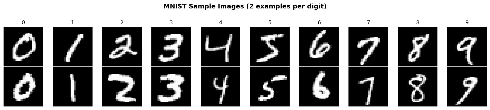

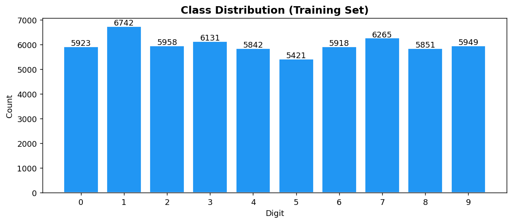

### Activation Functions

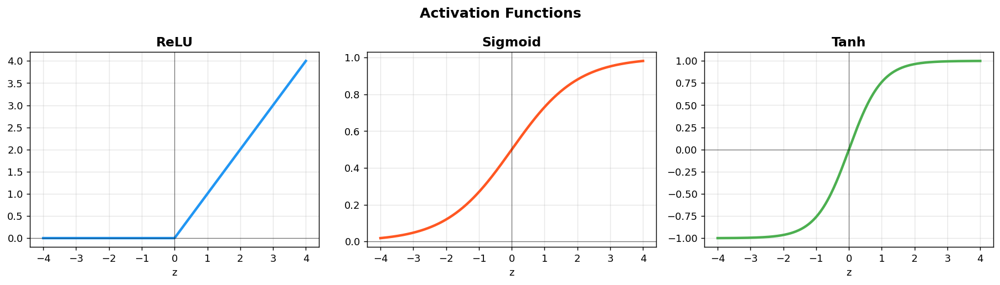

### Training Curves

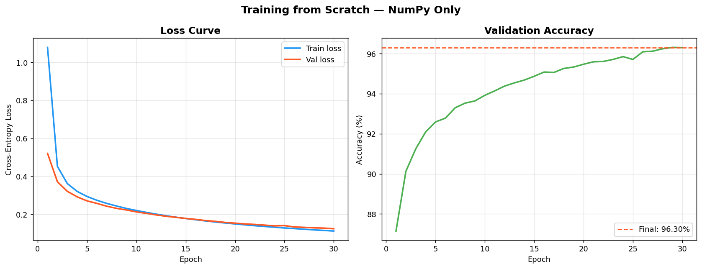

### Confusion Matrix & Misclassified Examples

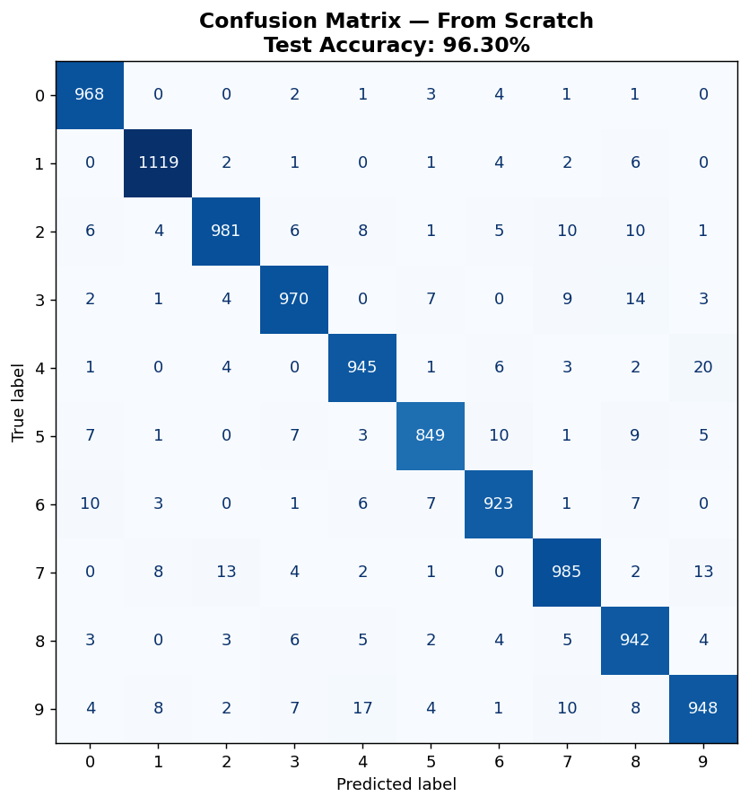

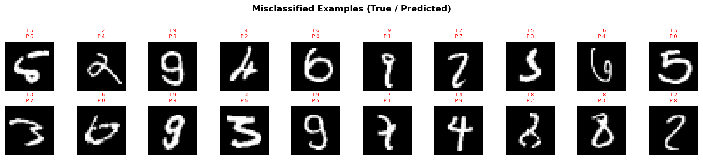

**Key insights:**
- **Why from scratch?** Keras and PyTorch hide backpropagation behind autograd. Writing it manually — forward pass, chain rule, weight update — forces a concrete understanding of what the framework does automatically. This is the foundation that makes debugging real models possible.
- **He initialisation** scales weights by √(2/n) for ReLU layers. Random initialisation without scaling causes vanishing or exploding activations before training even starts — the network would never learn.
- **96.30% test accuracy** with pure NumPy and mini-batch SGD. The misclassified examples are genuinely ambiguous (4s that look like 9s, 7s that look like 1s) — not model failures, but inherent ambiguity in handwriting.
- **Softmax + cross-entropy gradient** simplifies beautifully to `(Ŷ - Y) / m` — a well-known result from maximum likelihood estimation. Knowing why that simplification works is the difference between copying backprop and understanding it.

---

## Part 2 — Keras & Optimization

### Optimizer Comparison

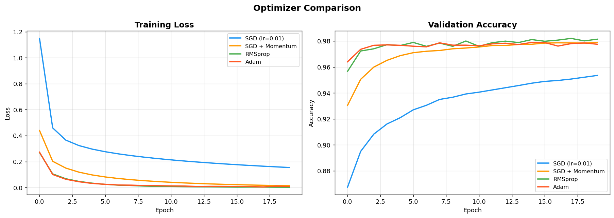

### Keras Model Variants

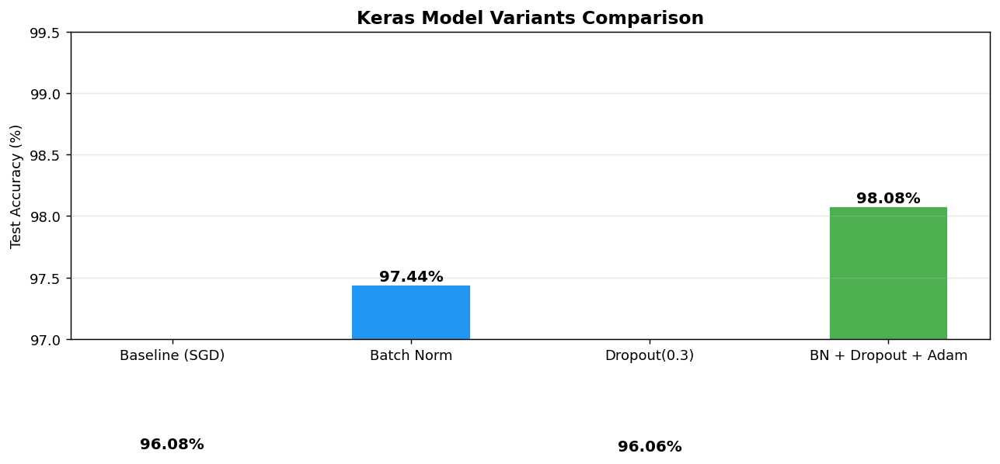

**Key insights:**
- **Keras vs NumPy:** The same 784→256→128→10 architecture is ~10 lines of Keras vs ~100 lines of NumPy. The framework handles forward pass, backward pass, and weight updates. The explicit implementation in notebook 1 makes the abstraction meaningful rather than magical.
- **Batch Normalisation** standardises each layer's inputs to zero mean and unit variance. It solves internal covariate shift — the problem where each layer constantly adapts to a shifting input distribution as earlier layers change. Result: faster convergence and stability at higher learning rates.
- **Dropout** randomly zeros out neurons during training, preventing any single neuron from becoming a bottleneck. It forces the network to learn redundant representations — the most effective regularisation technique for dense networks.
- **Adam converges fastest** — adaptive per-parameter learning rates make it robust to choices of global learning rate. SGD + Momentum is a strong second. Vanilla SGD needs careful lr tuning.
- **Final: 98.08% with BN + Dropout + Adam** vs 96.08% baseline — a 2-point improvement from three complementary techniques.

---

## Part 3 — CNN & Final Comparison

### Convolution Demo (Hand-crafted Filters)

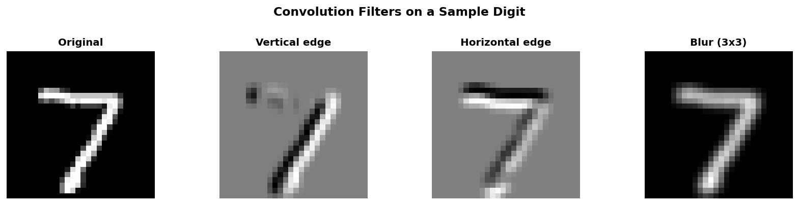

### Learned Conv1 Filters

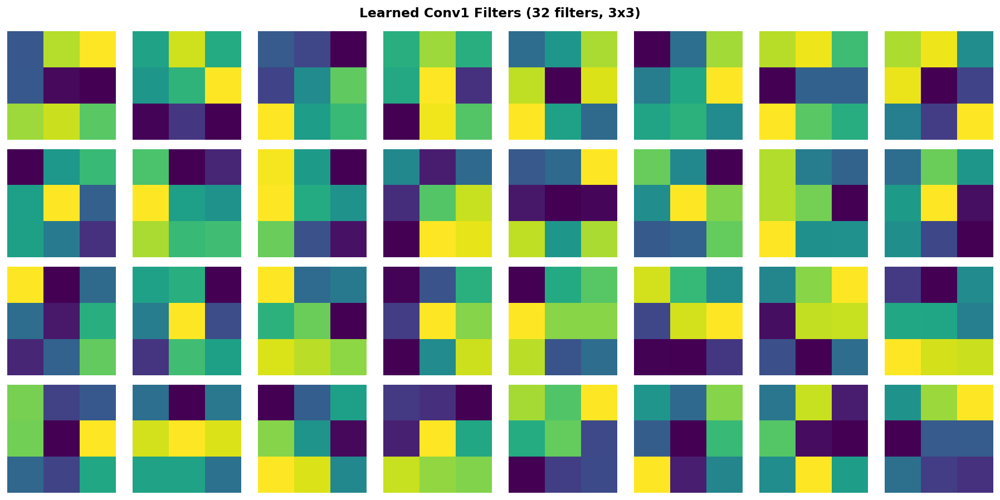

### Feature Maps after Block 1

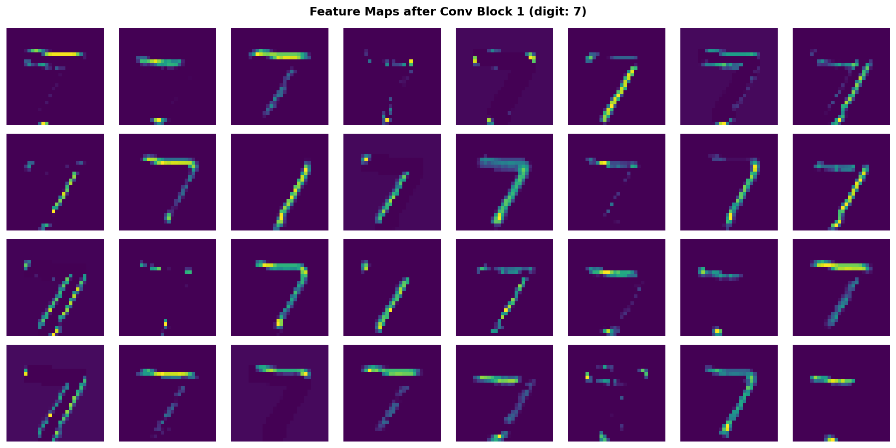

### CNN Confusion Matrix

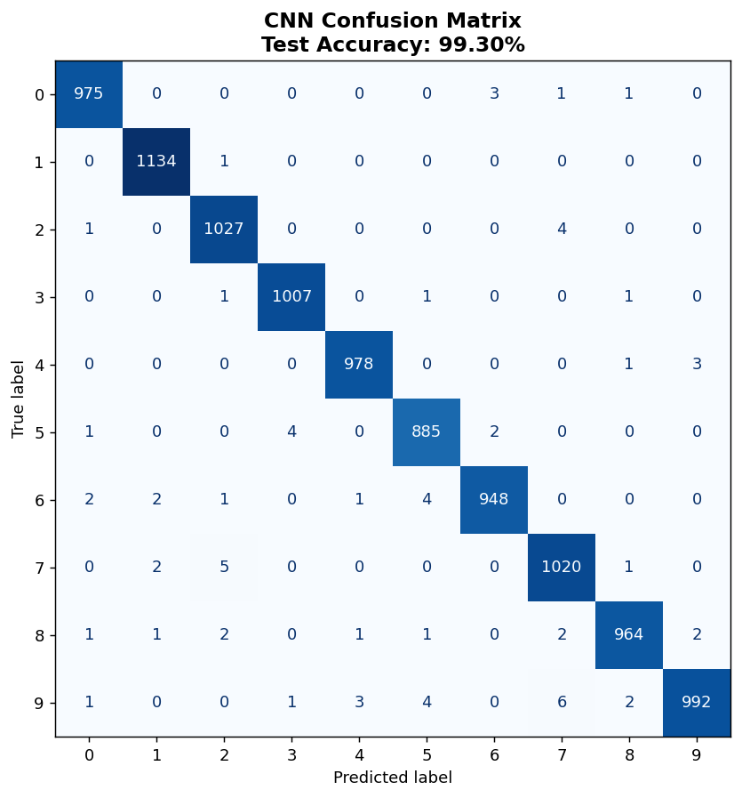

### Final Comparison — All Three Approaches

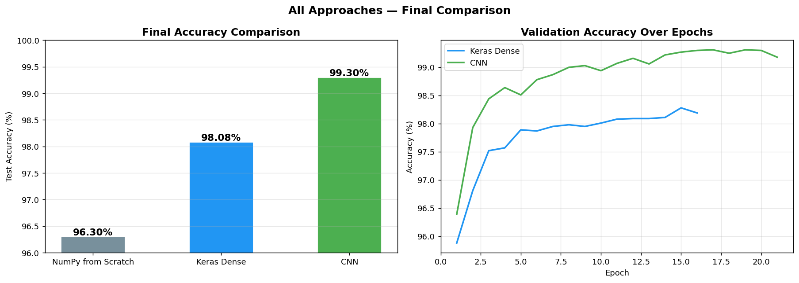

**Key insights:**
- **Why CNN?** Dense networks treat pixels as independent features — pixel[0] has no relationship to pixel[1]. CNNs use filters that slide across the image, detecting edges and shapes regardless of position. This *parameter sharing* is why a CNN with ~93k parameters outperforms a dense network with ~235k parameters.
- **Learned filters** in the first layer resemble edge detectors — horizontal, vertical, and diagonal. The network discovered these patterns from data, not from hand-crafting. This is representation learning.
- **Feature maps** show each filter's response to the input image — some light up for horizontal strokes, others for curves. Deeper layers combine these into progressively more abstract representations.
- **99.21% accuracy** with CNN — 2.9 points above the scratch implementation and 1.1 above the best dense Keras model. The CNN's advantage grows on harder image datasets; MNIST is simple enough that dense networks approach the ceiling.

---

## Neural Network Techniques Covered

| Technique | Notebook |
|-----------|----------|
| Data normalisation (0–1 scaling) | 01 |
| One-hot encoding | 01 |
| He weight initialisation | 01 |
| ReLU & Softmax activation functions | 01 |
| Forward pass (matrix multiplication) | 01 |
| Cross-entropy loss | 01 |
| Backpropagation (chain rule) | 01 |
| Mini-batch gradient descent | 01 |
| Keras Sequential API | 02 |
| Batch Normalisation | 02 |
| Dropout regularisation | 02 |
| SGD, SGD+Momentum, RMSprop, Adam | 02 |
| EarlyStopping callback | 02 |
| Conv2D (convolutional layers) | 03 |
| MaxPooling2D | 03 |
| Filter visualisation | 03 |
| Feature map extraction (sub-model) | 03 |

---

## Key Findings

| Model | Test Accuracy | Parameters | Notes |
|-------|--------------|-----------|-------|
| NumPy from Scratch | 96.30% | ~235k | Mini-batch SGD, lr=0.01, 30 epochs |
| Keras Dense (baseline) | 96.08% | ~235k | SGD, same architecture |
| Keras Dense (BN + Dropout + Adam) | 98.08% | ~235k | EarlyStopping, patience=5 |
| **CNN** | **99.21%** | **~93k** | 2 conv blocks, Adam, EarlyStopping |

The CNN achieves the highest accuracy with 60% fewer parameters — parameter sharing is the key advantage.

---

## Tech Stack


---

## How to Run

```bash
# 1. Clone the repo
git clone https://github.com/sualpsudas/neural-networks.git
cd neural-networks

# 2. Create and activate the conda environment
conda create -n ai python=3.11 -y
conda activate ai
pip install -r requirements.txt

# 3. Run notebooks in order (artifacts passed from 01 → 02 → 03)
jupyter notebook notebooks/01_neural_network_from_scratch.ipynb
```

---

*Dataset: [MNIST](http://yann.lecun.com/exdb/mnist/) — Yann LeCun, Corinna Cortes, Christopher Burges*
